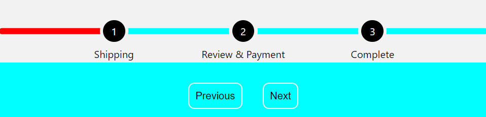
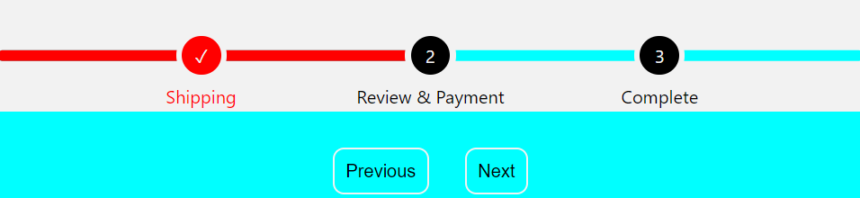
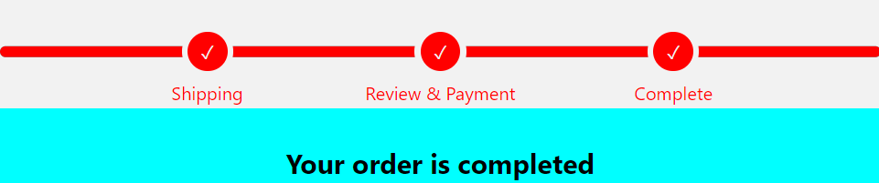

## Progress Bar component 

This project is a React functional component which can be implemented in any e-commerce app. The steps are changed along with the app route. 

## Built With

- CSS/HTML/JavaScript
- ReactJs

### Setup

To run the project locally you just need to clone the repository and run it. 

## Authors

👤 **Kire Mitrov**

- GitHub: (https://github.com/KireMitrov)
- LinkedIn: (https://www.linkedin.com/in/kiremitrov/)

## 🤝 Contributing

Contributions, issues, and feature requests are welcome!

## Show your support

Give a ⭐️ if you like this project!